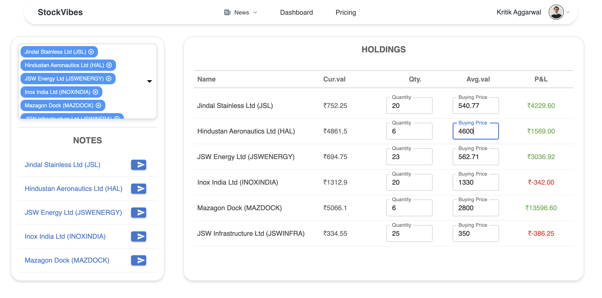
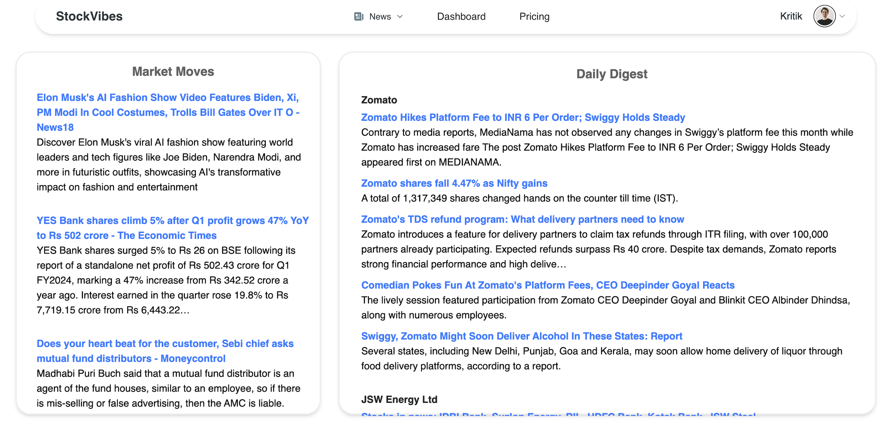
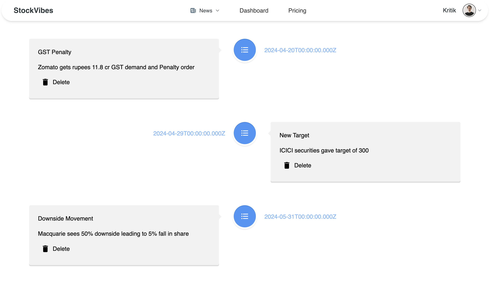

# StockVibe

StockVibe is a responsive web application designed for managing stock portfolios. The application allows users to add their shares and stay informed with the latest news and updates on selected stocks through the integration of NewsAPI.






## Features

- **Portfolio Management**: Add and manage your stock shares seamlessly.
- **Latest News Updates**: Receive the latest news and updates about your selected stocks with the integrated NewsAPI.
- **Stock Timeline**: View a detailed timeline for each stock, displaying:
  - Buy/sell actions
  - User notes
  - Relevant news
- **Secure Authentication**: 
  - JWT token-based authentication and Firebase email verification ensure robust protection for user data.
  - Passwords are securely hashed using bcrypt, enhancing security against unauthorized access.
- **Data Validation**: Zod is used for schema validation, ensuring data integrity and reducing runtime errors.
- **State Management**: Recoil is used for efficient and scalable state management.
- **Design**: The user interface is styled using Tailwind CSS and Material UI components for a modern and responsive design.

## Technologies Used

- **Frontend**: React.js, Recoil, Tailwind CSS, Material UI
- **Backend**: Node.js, Express.js
- **Database**: MongoDB
- **Authentication**: JWT, Firebase, bcrypt
- **API**: NewsAPI
- **Validation**: Zod

## Installation

1. **Clone the repository:**

   ```bash
   git clone https://github.com/yourusername/stockvibe.git
   cd stockvibe
2. Install dependencies:
   ```bash
   cd backend
   npm install
   cd ..
   cd frontend
   npm install
   cd ..
3. Set up environment variables:
   Create a .env file in the frontend directory with the following variables:
     ```bash
     VITE_EMAILJS_PUBLIC_KEY="your_emailjs_public_key"
     VITE_EMAILJS_SERVICE_ID="your_emailjs_service_id"
     VITE_EMAILJS_TEMPLATE_ID="your_emailjs_template_id"
     VITE_FIREBASE_API_KEY="your_firebase_api_key"
     VITE_FIREBASE_AUTH_DOMAIN="your_firebase_auth_domain"
     VITE_FIREBASE_PROJECT_ID="your_firebase_project_id"
     VITE_FIREBASE_STORAGE_BUCKET="your_firebase_storage_bucket"
     VITE_FIREBASE_MESSAGING_SENDER_ID="your_firebase_messaging_sender_id"
     VITE_FIREBASE_APP_ID="your_firebase_app_id"
     VITE_FIREBASE_MEASURMENT_ID="your_firebase_measurement_id"
     VITE_NEWSAPI_KEY="your_newsapi_key"
     VITE_API_BASE_URL="your backend port address"
 create a .env in backend:
     ```bash
      
      JWT_SECRET="stockVibe"
4.Run the application:
  To start the backend server:
    ```bash
      
      cd backend
      node index.js
  To start frontend server:
  open a new terminal with stockVibe as root folder:
     ```bash
     
        cd frontend
        npm run dev
        
## Contributing
Contributions are welcome! Please open an issue or submit a pull request for any changes.

## Contact
For any questions or feedback, please contact krish.nimje2003@gmail.com.


### Additional Notes:
- Make sure to adjust the environment variable settings and paths as needed.
- Update the placeholders with your actual project details.
- Ensure you have both the `backend` and `frontend` directories correctly set up with their respective `package.json` files.

